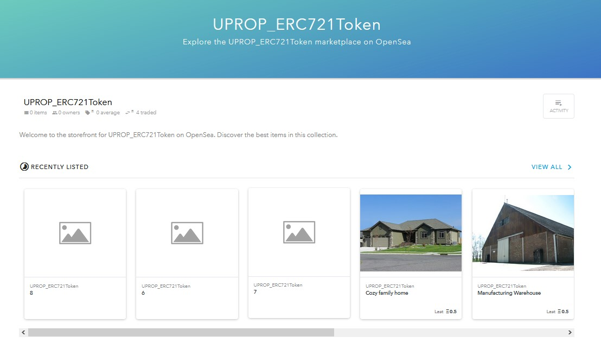
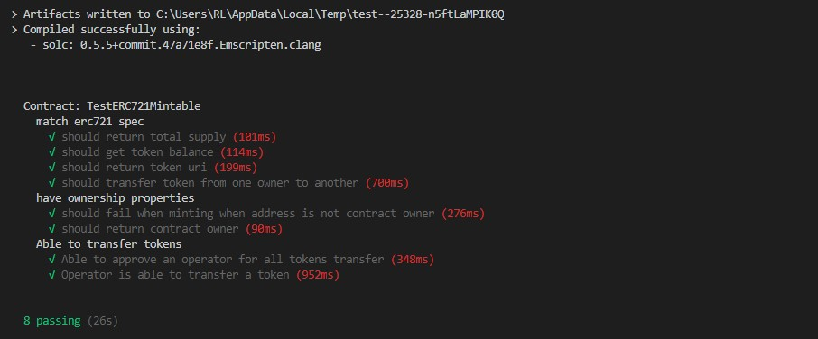
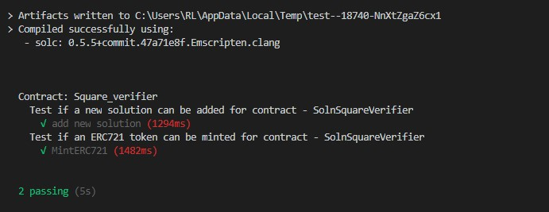

# Decentralized Real Estate Marketplace

- A property is represented as NFT721 token on Ethereum Rinkey testnet
    - Contract Address: https://rinkeby.etherscan.io/address/0x1898e139aa999ba3d7650b0f74e2d6e53a41fdda
- All tokens are listed on OpeanSea
    - MarketPlace Storefront: https://testnets.opensea.io/collection/uprop-erc721token

  

## Versions

      truffle: Truffle Truffle v5.1.53
      truffle-compiler: 0.5.5+commit.47a71e8f.Emscripten.clang

## Contracts

### SolnSquareVerifier.sol

<b>Note</b>: SolnSquareVerifier inherits all other contracts except verifier.sol

Completed contract that inherits the ERC721 token with zkSnarks that enhances privacy and scalability.

### verifier.sol

Implements Succinct Zero-knowledge proofs via Zokrates.

---

## Quick Start Deploying to Ganache and Testing

1. cd into project repro & install modules

        cd Blockchain-Capstone-master

        npm install

2. Compile Contracts

        cd eth-contracts

        truffle compile

3. Start ganache (CLI or GUI)

4. Mirgrate locally

        truffle migrate --network development --reset

## Testing contracts
<b>Make sure you are in "eth-contracts" dirctory</b>: cd eth-contracts

Testing ERC721 minting functionality of tokens and transfer of tokens.
    
    truffle test ./test/TestERC721Mintable.js

Test zkSnarks is successfully implemented.

    truffle test ./test/TestSquareVerifier.js

Testing ERC721 token minting with zkSnarks.

    truffle test ./test/TestSolnSquareVerifier.js

    
    
    

---

## Deploying to Rinkeby

1. Make a new project with Infura

    Infura: https://infura.io

2. Setup truffle-config

    2.1 set Rinkeby mnemonic from metamask within HDWalletProvider

    2.2 set infura endpoint for Rinkeby within HDWalletProvider

3. Migrate to rinkeby

        truffle migrate --network rinkeby

4. Finding ER721 token on ether-scan

  https://rinkeby.etherscan.io/token/0x1898e139aa999ba3d7650b0f74e2d6e53a41fdda

5. Minting tokens

  https://www.myetherwallet.com/interface/interact-with-contract

## Tokens on OpenSea are sold

  https://testnets.opensea.io/assets/0x1898e139aa999ba3d7650b0f74e2d6e53a41fdda/0/
  https://testnets.opensea.io/assets/0x1898e139aa999ba3d7650b0f74e2d6e53a41fdda/1/
  https://testnets.opensea.io/assets/0x1898e139aa999ba3d7650b0f74e2d6e53a41fdda/2/
  https://testnets.opensea.io/assets/0x1898e139aa999ba3d7650b0f74e2d6e53a41fdda/3/
  https://testnets.opensea.io/assets/0x1898e139aa999ba3d7650b0f74e2d6e53a41fdda/4/

## Project Resources

* [Remix - Solidity IDE](https://remix.ethereum.org/)
* [Visual Studio Code](https://code.visualstudio.com/)
* [Truffle Framework](https://truffleframework.com/)
* [Ganache - One Click Blockchain](https://truffleframework.com/ganache)
* [Open Zeppelin ](https://openzeppelin.org/)
* [Interactive zero knowledge 3-colorability demonstration](http://web.mit.edu/~ezyang/Public/graph/svg.html)
* [Docker](https://docs.docker.com/install/)
* [ZoKrates](https://github.com/Zokrates/ZoKrates)